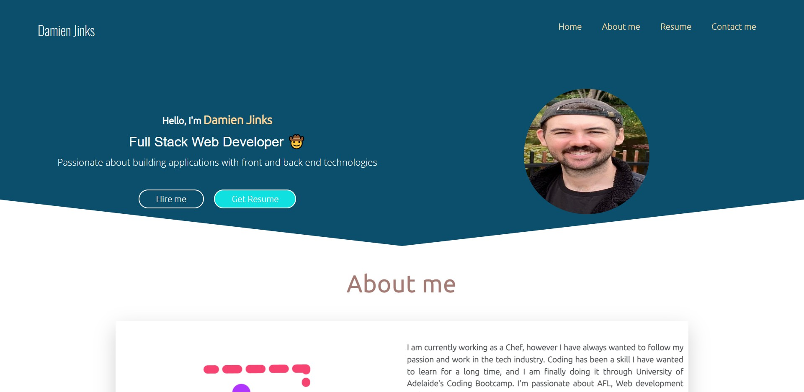
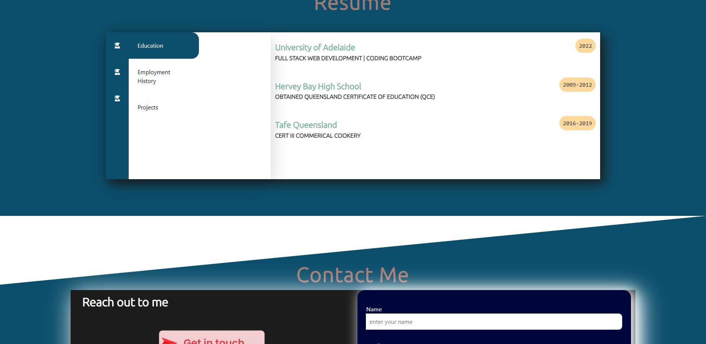

# Damien Jinks React Portfolio

## Github pages link https://djinksy.github.io/react-portfolio/

 

## Description 

Welcome to my react portfolio, This application was created for my present and future employers to check out my skill set. 

# Table of Contents
    
- [Installation](#installation)
    
- [Usage](#usage)
    
- [License](#license)
    
- [Contributing](#contributing)
    
- [Test](#test)
    
- [Questions](#questions)

# Installation

To install the repository, please use the following command:

`npm i` 

# Usage

This react portfolio was created for present and future employees to check out my skill set and projects I have worked on.

# License 

This repository is under no license.

# Test

There are no test for this application.

# Questions
  For any questions and comments please email me at: 
  damienjinks39@gmail.com.
  To view my other projects visit: 
  [Djinksy](https://github.com/Djinksy) on Github.